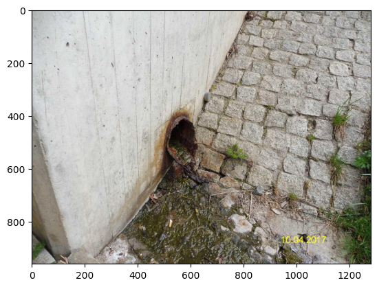
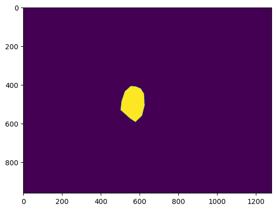

# :dog: dacl10k-toolkit

<!-- [](https://twitter.com/dacl_ai) [](http://dacl.ai/) -->

**[Twitter](https://twitter.com/dacl_ai) | [WACV](https://wacv2024.thecvf.com/workshops/) | [arXiv](https://arxiv.org/abs/2309.00460) | [Explore the Dataset](https://try.fiftyone.ai/datasets/dacl10k/samples) | [Hugging Face Spaces](https://huggingface.co/spaces/phiyodr/dacl-challenge) | [eval.ai](https://eval.ai/web/challenges/challenge-page/2130/overview) | [dacl.ai Workshop Page](https://dacl.ai/workshop.html)**

:information_source: This module should act as an entry point for simple data usage for the dacl10k dataset.

:name_badge: dacl10k stands for *damage classification 10k images* and is a **multi-label semantic segmentation** dataset for 19 classes (13 damages and 6 objects) present on bridges. 

:trophy: This dataset is used in the challenge associated with the **"1st Workshop on Vision-Based Structural Inspections in Civil Engineering" at [WACV2024](https://wacv2024.thecvf.com/).**

, \textit{Washouts/Concrete corrosion} (WConccor), \textit{Expansion Joint} (EJoint), \textit{Protective Equipment} (PEquipment) and \textit{Joint Tape} (JTape).
    From left to right, the images display the individual classes: 1. \textit{Weathering, Spalling, Exposed Rebars, Rust}; 2. \textit{Weathering, Crack}; 3. \textit{Alligator Crack, Restformwork, Efflorescence}; 4. \textit{Weathering, Crack, Spalling, Rockpocket}; 5. \textit{Crack, Rust, Expansion Joint, Spalling}; 6. \textit{Weathering, Rockpocket, Spalling, Efflorescence, Crack, Rust, Restformwork, Joint Tape}; 7. \textit{Weathering, Protective Equipment, Rockpocket, Efflorescence, Crack, Hollowareas, Alligator Crack, Drainage}; 8. \textit{Weathering, Spalling, Crack, Rust, Bearing ")


## :arrow_right:  Installation

```python
python -m pip install git+https://github.com/phiyodr/dacl10k-toolkit
```

* Requirements: See `requirements.txt`
* Tested on Ubuntu 20.04 LTS with Python 3.10

## :arrow_right: Data 

:page_with_curl: Data licence: [(CC BY-NC 4.0)](https://creativecommons.org/licenses/by-nc/4.0/)

:memo: Please cite the corresponding paper:  [Johannes Flotzinger, Philipp J. Rösch and Thomas Braml, "dacl10k: Benchmark for Semantic Bridge Damage Segmentation," arXiv:2309.00460 [cs.CV], Sep. 2023.](https://arxiv.org/abs/2309.00460)"

### Explore the dacl10k dataset

**(new!) Visualize dacl10k with the [Voxel51](https://github.com/voxel51/fiftyone) demo:**
[![FiftyOne](https://img.shields.io/badge/FiftyOne-blue.svg?logo=data:image/svg+xml;base64,PD94bWwgdmVyc2lvbj0iMS4wIiBlbmNvZGluZz0idXRmLTgiPz4KPCEtLSBHZW5lcmF0b3I6IEFkb2JlIElsbHVzdHJhdG9yIDI3LjMuMSwgU1ZHIEV4cG9ydCBQbHVnLUluIC4gU1ZHIFZlcnNpb246IDYuMDAgQnVpbGQgMCkgIC0tPgo8c3ZnIHZlcnNpb249IjEuMSIgaWQ9IkxheWVyXzEiIHhtbG5zPSJodHRwOi8vd3d3LnczLm9yZy8yMDAwL3N2ZyIgeG1sbnM6eGxpbms9Imh0dHA6Ly93d3cudzMub3JnLzE5OTkveGxpbmsiIHg9IjBweCIgeT0iMHB4IgoJIHZpZXdCb3g9IjAgMCA1MjAuNyA0NzIuNyIgc3R5bGU9ImVuYWJsZS1iYWNrZ3JvdW5kOm5ldyAwIDAgNTIwLjcgNDcyLjc7IiB4bWw6c3BhY2U9InByZXNlcnZlIj4KPHN0eWxlIHR5cGU9InRleHQvY3NzIj4KCS5zdDB7ZmlsbDojRkY2RDAwO30KCS5zdDF7ZmlsbDojOUI5QjlCO30KPC9zdHlsZT4KPGcgaWQ9InN1cmZhY2UxIj4KCTxwYXRoIGNsYXNzPSJzdDAiIGQ9Ik0xMjAuOSw0My4yYzAtMi4yLDEuMy0zLjUsMi4yLTMuOGMwLjYtMC4zLDEuMy0wLjYsMi4yLTAuNmMwLjYsMCwxLjYsMC4zLDIuMiwwLjZsMTMuNyw4TDE2Ny42LDMybC0yNi44LTE1LjMKCQljLTkuNi01LjQtMjEuMS01LjQtMzEsMGMtOS42LDUuOC0xNS4zLDE1LjctMTUuMywyNi44djI4Ni4zbDI2LjIsMTUuM3YtMzAyaDAuMlY0My4yeiIvPgoJPHBhdGggY2xhc3M9InN0MCIgZD0iTTEyNy45LDQyOS42Yy0xLjksMS0zLjgsMC42LTQuNSwwYy0xLTAuNi0yLjItMS42LTIuMi0zLjh2LTE1LjdMOTUsMzk0Ljd2MzFjMCwxMS4yLDUuOCwyMS4xLDE1LjMsMjYuOAoJCWM0LjgsMi45LDEwLjIsNC4yLDE1LjMsNC4yYzUuNCwwLDEwLjUtMS4zLDE1LjMtNC4yTDQwMiwzMDEuN3YtMzAuNEwxMjcuOSw0MjkuNnoiLz4KCTxwYXRoIGNsYXNzPSJzdDAiIGQ9Ik00NzIuNCwyMDcuOGwtMjQ4LTE0My4ybC0yNi41LDE1TDQ1OSwyMzAuNWMxLjksMS4zLDIuMiwyLjksMi4yLDMuOHMtMC4zLDIuOS0yLjIsMy44bC0xMS44LDYuN3YzMC40CgkJbDI0LjktMTQuNGM5LjYtNS40LDE1LjMtMTUuNywxNS4zLTI2LjhDNDg3LjcsMjIzLjEsNDgyLDIxMy4yLDQ3Mi40LDIwNy44eiIvPgoJPHBhdGggY2xhc3M9InN0MSIgZD0iTTc5LjcsMzY4LjVsMjIuNywxMy4xbDI2LjIsMTUuM2w3LjcsNC41bDUuNCwzLjJsOTUuNS01NS4zdi05NS4yYzAtMTIuMSw2LjQtMjMuMywxNi45LTI5LjRsODIuNC00Ny42CgkJTDE5MC4yLDkyLjhsLTIyLjctMTMuMWwyMi43LTEzLjFsMjYuMi0xNS4zbDcuNy00LjVsNy43LDQuNWwxNjEsOTMuM2wzLjItMS45YzkuMy01LjQsMjEuMSwxLjMsMjEuMSwxMi4xdjMuOGwxNSw4LjZWMTQyCgkJYzAtMTIuNS02LjctMjQtMTcuMy0zMEwyNTQuNSwxOS4zYy0xMC45LTYuNC0yNC02LjQtMzQuOCwwTDEzNiw2Ny42djMwMy4ybC0yMi43LTEzLjFMODcsMzQyLjNsLTcuMy00LjJ2LTIzOGwtMjAuMSwxMS41CgkJYy0xMC45LDYuMS0xNy4zLDE3LjYtMTcuMywzMHYxODVjMCwxMi41LDYuNywyNCwxNy4zLDMwTDc5LjcsMzY4LjV6Ii8+Cgk8cGF0aCBjbGFzcz0ic3QxIiBkPSJNNDE3LjEsMjIzLjh2OTQuOWMwLDEyLjEtNi40LDIzLjMtMTYuOSwyOS40bC0xNDEuOSw4Mi4xYy05LjMsNS40LTIxLjEtMS4zLTIxLjEtMTIuMXYtMy44TDE5Ny45LDQzNwoJCWwyMS43LDEyLjVjMTAuOSw2LjQsMjQsNi40LDM0LjgsMEw0MTQuNiwzNTdjMTAuOS02LjQsMTcuMy0xNy42LDE3LjMtMzB2LTk0LjZMNDE3LjEsMjIzLjh6Ii8+CjwvZz4KPC9zdmc+Cg==)](https://try.fiftyone.ai/datasets/dacl10k/samples)


### Download

| Data File                      | Download                        | sha256sum  | 
|--------------------------------|----------------------------------|-------------|
| `dacl10k_v2_devphase.zip`      | [[GigaMove]](https://gigamove.rwth-aachen.de/en/download/ae8278474b389aa9cc0ab6c406b7a466)¹ [[AWS]](https://dacl10k.s3.eu-central-1.amazonaws.com/dacl10k-challenge/dacl10k_v2_devphase.zip) | dcbcd5fb82699076a2c7f3a72492a9ef798870e0ca1f0c9399360f273ea95260 |
| `dacl10k_v2_testchallenge.zip` | [Challenge phase starts at 19 October 2023] |    |          

¹ Hosted at [RWTH Aachen University](https://gigamove.rwth-aachen.de/).

### Folder structure


The data should be in folder `path_to_data` and in the following format:

```bash
├── annotations
│   ├── train (n=6.935)
│   └── validation (n=975)
└── images
    ├── train (n=6.935)
    ├── validation (n=975)
    ├── testdev (n=1.012)
    └── testchallenge (will be made available on 02 October 2023)
```


### Task

Multi-label semantic segmentation

* Multi-label: Each pixel can be associated with several classes, e.g. a surface can have Rust and Crack (2 damages) or Rust on Drainage (1 damage and 1 object).
* Semantic segmentation: Pixel detailed annotation of damages and objects.
* We do not care about "instances". If several polygons of the same class overlap, they are merged into one mask. 

For evaluation we use [mean Intersection over Union (mIoU)](https://github.com/qubvel/segmentation_models.pytorch/blob/67aceba4b832a36cb99c2184a06a204ba43c4ea1/segmentation_models_pytorch/utils/metrics.py#L6).


### Annotation files

Annotation files originate from [labelme](https://github.com/wkentaro/labelme/tree/main/examples/semantic_segmentation)-format and are slightly adjusted.
One JSON file looks like this:

```javascript
{'imageWidth': 1280,
 'imageHeight': 960,
 'imageName': 'dacl10k_v2_validation_0012.jpg',
 'imagePath': 'images/train/dacl10k_v2_validation_0012.jpg', 
 'split': 'validation',
 'dacl10k_version': 'v2',
 'shapes': [{'label': 'Rust',
   'points': [...],
   'shape_type': 'polygon'},
  {'label': 'Rust',
   'points': [...],
   'shape_type': 'polygon'},
  {'label': 'Drainage',
   'points': [[581.5714285714286, 410.2857142857142],
    [555.8571428571428, 407.4285714285714],
    [524.4285714285713, 435.99999999999994],
    [507.2857142857142, 486.0],
    [502.99999999999994, 531.7142857142857],
    [550.1428571428571, 574.5714285714286],
    [578.7142857142857, 593.1428571428571],
    [612.9999999999999, 560.2857142857142],
    [625.8571428571428, 508.8571428571428],
    [622.9999999999999, 447.42857142857133],
    [605.8571428571428, 420.2857142857142]],
   'shape_type': 'polygon'}]}
```

Explanation:

* `imageWidth`, `imageHeight`: Image width and height (many different image sizes exists).
* `imageName`, `imagePath`, `split`: Corresponding image name and full path, as well the corresponding dataset split. 
* `dacl10k_version`: The first version of the arXiv paper uses v1 and the challenge uses v2.
* `shapes` (list of dictionaries): Each dictionary contains
  * `label` (str): Name of the class
  * `points` (list of lists): List of edge points of the polygone (x, y). Origin in top-left corner.
  * `shape_type`: Always 'polygone' (originates from labelme)


### Labels/Classes

Each polygone can have one of 19 classes. For detailed explanation please see [XXXX](https://arxiv.org/XXXX).

* 13 damage classes: Crack, Alligator Crack (ACrack), Wetspot, Efflorescence, Rust, Rockpocket, Hollowareas, Cavity, Spalling, Graffiti, Weathering, Restformwork, Exposed Rebars (ExposedRebars), 
* 6 object classes: Bearing, Expansion Joint (EJoint), Drainage, Protective Equipment (PEquipment), Joint Tape (JTape), Washouts/Concrete corrosion (WConccor)


## :arrow_right: Toolkit

* `Dacl10kDataset` a `torch Dataset` class for the **dacl10k** dataset.
* `utils` with `labelme2mask`, `resize_images`, and `resize_annotations`  
  
### Dacl10kDataset (`torch.utils.data.Dataset`)

:information_source: This functionality should be a starting point for simple Torch `Dataset` usage. It is not a comprehensive dataset module for all SOTA work (e.g. no [augmentation](https://albumentations.ai/docs/getting_started/mask_augmentation/), etc.).

What is does:

* Loades images and resize it to a given shape
* Loades annotation files ([labelme](https://github.com/wkentaro/labelme/tree/main/examples/semantic_segmentation)-like format) and creates a target mask (`torch.tensor`) for the 19 classes from the Polygones provided.

```python
from dacl10k.dacl10kdataset import Dacl10kDataset
```

#### Default usage of Dacl10kDataset

```python
split = "validation" # "train", "testdev" (later also "testchallenge")
path_to_data = "my/path/to/data"
dataset = Dacl10kDataset(split, path_to_data, resize_mask=(512, 512), resize_img=(512, 512), normalize_img=True)
img, mask = dataset[100]
img.shape, mask.shape
#> (torch.Size([3, 512, 512]), torch.Size([19, 512, 512]))
```

* The mask has 19 channels in the following order:

```python
dataset.TARGET_LIST
#> ['Crack', 'ACrack', 'Wetspot', 'Efflorescence', 'Rust', 'Rockpocket', 'Hollowareas', 'Cavity', 'Spalling', 'Graffiti', 'Weathering', 'Restformwork', 'ExposedRebars', 'Bearing', 'EJoint', 'Drainage', 'PEquipment', 'JTape', 'WConccor']
```

Advantage:

* Easy to start implementation for loading images (.jpg) and annotations (.json).

Disadvantage:

* Images are large, hence loading takes a lot of time. Annotations are available in Polygone format and need to be transformed to masks, this takes a lot of time. To overcome this problem use *prefetching*.


#### Prefetched usage of Dacl10kDataset

What is does:

* All images and annotations in the current split are loaded (in a distributed fashion using `n_jobs` workers) and stored in a dictionary. Loading is done once at the beginning and not during training.

```python
split = "validation" # "train", "testdev" (later also "testchallenge")
path_to_data = "my/path/to/data"
dataset = Dacl10kDataset(split, path_to_data, resize_mask=(512, 512), resize_img=(512, 512), normalize_img=True)

dataset.run_prefetching(n_jobs=10)
#> Prefetching started
#> Prefetchting: 100%|████████████████████████| 975/975 [04:49<00:00,  3.36it/s]
#> Prefeching done. Data stored in `self.prefetched_data`.

len(dataset.prefetched_data), type(dataset.prefetched_data)
#> (975, dict)

sample = dataset.prefetched_data["dacl10k_v2_validation_0000.jpg"]
sample.keys()
#> dict_keys(['image', 'mask'])
```

* It is best to save the prefetched data, so you can reuse it: 

```python
path_to_store_prefechted_data = "my/path/to/store/prefetched/data"
dataset.save_prefetched_data(path_to_store_prefechted_data) # you can also pass a filename if you want otherwise the split name ("validation.pkl") is used.
#> Start saving prefeched data.
#> Prefetched data saved in my/path/to/store/prefeched/data/validation.pkl.
del dataset 
```

* Load data using `load_prefetched_data`. Since images and masks are already in requested format you should set `resize_mask` and `resize_img` to `None`:

```python
filename_of_prefechted_data= "validation.pkl"
dataset = Dacl10kDataset(split, path_to_data, resize_mask=None, resize_img=None, normalize_img=True)
dataset.load_prefetched_data(path_to_store_prefechted_data, filename_of_prefechted_data)
img, mask = dataset[100]
img.shape, mask.shape
#> (torch.Size([3, 512, 512]), torch.Size([19, 512, 512]))
```

Advantage:

* Loading images and annotations in Dacl10kDataset and DataLoader is super quick.
* Prefetched data is already in requested image and mask size (saves memory). 

Disadvantage:

* You need to run prefetching once in the beginning, which takes some time (approx. 10 min for 1k images using 10 workers).


### Utility functions: `utils`

```python
from dacl10k import utils
```

#### labelme2mask

Annotations are provided in [labelme](https://github.com/wkentaro/labelme/blob/main/README.md)-like format.
With `utils.labelme2mask` transform from labelme to dense array format is made easy.

* Load annotation file:

```python
import matplotlib.pyplot as plt
from PIL import Image

image_file = "my/path/to/data/images/validation/dacl10k_validation_0012.jpg"
annotation_file = "my/path/to/data/annotations/validation/dacl10k_validation_0012.json"

utils.open_json(annotation_file)
```

* The annotation in labelme-like format looks like this:

```javascript
{'imageWidth': 1280,
 'imageHeight': 960,
 'imageName': 'dacl10k_v2_validation_0012.jpg',
 'imagePath': 'images/train/dacl10k_v2_validation_0012.jpg', 
 'split': 'validation',
 'dacl10k_version': 'v2',
 'shapes': [{'label': 'Rust',
   'points': [...],
   'shape_type': 'polygon'},
  {'label': 'Rust',
   'points': [...],
   'shape_type': 'polygon'},
  {'label': 'Drainage',
   'points': [[581.5714285714286, 410.2857142857142],
    [555.8571428571428, 407.4285714285714],
    [524.4285714285713, 435.99999999999994],
    [507.2857142857142, 486.0],
    [502.99999999999994, 531.7142857142857],
    [550.1428571428571, 574.5714285714286],
    [578.7142857142857, 593.1428571428571],
    [612.9999999999999, 560.2857142857142],
    [625.8571428571428, 508.8571428571428],
    [622.9999999999999, 447.42857142857133],
    [605.8571428571428, 420.2857142857142]],
   'shape_type': 'polygon'}]}
```

* In the following we are interested in `Drainage`, which has index `15` in the TARGET_LIST. 
* We display the example image `img`.

```python
# Create map from target name to index. In this example we are interested in `Drainage`.
target_dict = dict(zip(utils.TARGET_LIST, range(len(utils.TARGET_LIST))))
target_of_interest = target_dict["Drainage"]

# Display image
img = Image.open(image_file)
img.close()
plt.imshow(img)
plt.show()
```



* We transform the labelme-like dictionary to a dense mask format (`numpy`) and plot it: 

```python
# Apply labelme2mask transforms
mask = utils.labelme2mask(annotation_file)
mask.shape, type(mask)
#> ((960, 1280, 19), numpy.ndarray)
plt.imshow(mask[:, :, target_of_interest])
plt.show()
```




#### Resize images and annotations


If you want to resize images and all values in the annotations files at once, you can use following utilities:

```python
# Resize images
source_folder = "my/path/to/data/images/validation"
target_folder = "my/path/to/resized/data/images/validation"
utils.resize_images(source_folder, target_folder, size=(512,512))

# Resize annotations (in JSON files)
source_folder = "my/path/to/data/annotations/validation"
target_folder = "my/path/to/resized/data/annotations/validation"
utils.resize_annotations(source_folder, target_folder, size=(512,512))
```

Example file from source folder:

```javascript
{'imageWidth': 1280,
 'imageHeight': 960,
 'imageName': 'dacl10k_v2_validation_0012.jpg',
 'imagePath': 'images/train/dacl10k_v2_validation_0012.jpg', 
 'split': 'validation',
 'dacl10k_version': 'v2',
 'shapes': [{'label': 'Rust',
   'points': [...],
   'shape_type': 'polygon'},
  {'label': 'Rust',
   'points': [...],
   'shape_type': 'polygon'},
  {'label': 'Drainage',
   'points': [[581.5714285714286, 410.2857142857142],
    [555.8571428571428, 407.4285714285714],
    [524.4285714285713, 435.99999999999994],
    [507.2857142857142, 486.0],
    [502.99999999999994, 531.7142857142857],
    [550.1428571428571, 574.5714285714286],
    [578.7142857142857, 593.1428571428571],
    [612.9999999999999, 560.2857142857142],
    [625.8571428571428, 508.8571428571428],
    [622.9999999999999, 447.42857142857133],
    [605.8571428571428, 420.2857142857142]],
   'shape_type': 'polygon'}]}
```

Corresponding example in target folder (with new `imageWidth`, `imageHeight`, and `points`):

```javascript
{'imageWidth': 512,
 'imageHeight': 512,
 'imageName': 'dacl10k_v2_validation_0012.jpg',
 'imagePath': 'images/train/dacl10k_v2_validation_0012.jpg', 
 'split': 'validation',
 'dacl10k_version': 'v2',
 'shapes': [{'label': 'Rust',
   'points': [...]
   'shape_type': 'polygon'},
  {'label': 'Rust',
   'points': [...],
   'shape_type': 'polygon'},
  {'label': 'Drainage',
   'points': [[232.62857142857143, 218.81904761904758],
    [222.3428571428571, 217.29523809523806],
    [209.77142857142854, 232.5333333333333],
    [202.91428571428568, 259.2],
    [201.2, 283.58095238095234],
    [220.05714285714285, 306.43809523809523],
    [231.48571428571427, 316.3428571428571],
    [245.19999999999996, 298.8190476190476],
    [250.3428571428571, 271.39047619047614],
    [249.19999999999996, 238.62857142857138],
    [242.3428571428571, 224.15238095238092]],
   'shape_type': 'polygon'}]}
```

